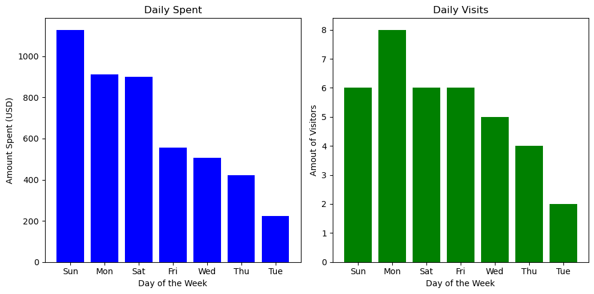
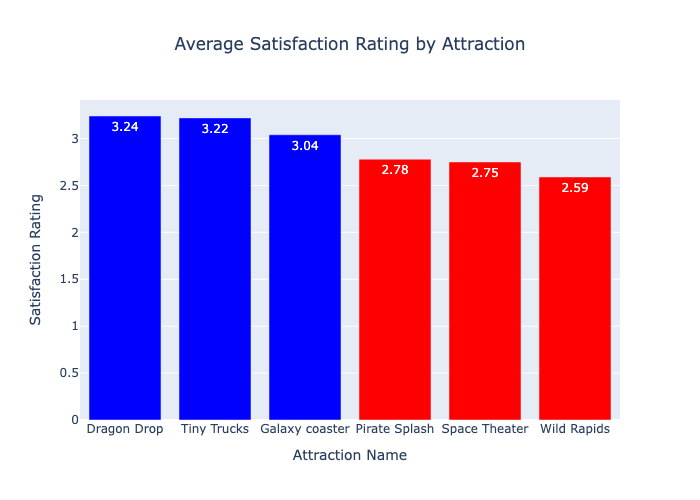
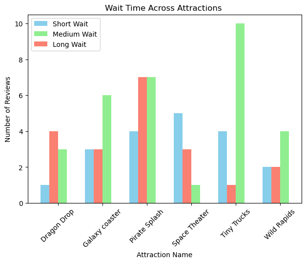

# Beyond the Gate: Driving Guest Satisfaction and Profitability Together
By Kevin Serrano Lopez

# Business Problem
The Supernova theme park is struggling with uneven guest satisfaction and inconsistent revenue, driven by long attraction wait times, unpredictable ride availability, and overcrowding. At the same time, marketing campaigns are drawing visitors but not always the most profitable ones, as discount-driven guests often spend less in-park. Leadership needs a coordinated strategy that balances operational efficiency with targeted marketing to improve both guest experience and overall profitability.

# Stakeholders
### Primary Stakeholder: 
 - Park General Manager (GM) – accountable for overall park performance, satisfaction, and revenue outcomes.
### Supporting Stakeholders:
- Operations Director – focused on staffing, queue management, and ride uptime, since these directly impact guest satisfaction
- Marketing Director – responsible for promotions and ticket sales strategy, ensuring campaigns attract high-value guests and support revenue growth.

# Overview of Database & Schema
### Dimension tables: 
- dim_guest, dim_ticket, dim_attraction, dim_date
- stores descriptive attributes about guests, tickets, attractions (rides) and time. They store the context behind each visit.
### Fact Tables :
- fact_visits, fact_ride_events, fact_purchases
- They capture measurable events like park entry, ride usage and purchases
- Hold numeric values that can be aggregated.

#### Star Schema Benefits
- Simplifies analysis, facts are in the middle and easy to join with descriptive dimensions
- Faster queries - Aggregations are efficient
- Flexiblity - easier to look into performance by guest without restructuring the data

# [**EDA (SQL)**](./sql/01_eda.sql)

### Visits by Ticket Type
I explored visit patterns over time and by ticket type, joinng fact_visits to dim_ticket. This highlights which ticket category drives the most visits and the distribution of volumn across days of the week.
```sql
SELECT 
  DISTINCT(dt.ticket_type_name) AS ticket_name,
  COUNT(*) AS number_of_visits -- counts the number of visits
FROM fact_visits fv
INNER JOIN dim_ticket dt ON fv.ticket_type_id = dt.ticket_type_id
GROUP BY ticket_name 
ORDER BY number_of_visits DESC 
```
**WHY:** Helps marketing understand which promotions/ticket types attract volume, and operations gauge crowding trends

### Guest Experience: Waits & Satisfaction
I analyzed fact_ride_events for wait time distributions and average satisfiaction ratings by attraction (full code in link above). This connects wait time  with guest rating.
```sql
SELECT
  a.attraction_name,
  a.category, 
  AVG(r.satisfaction_rating) AS avg_rating
FROM fact_ride_events r
JOIN dim_attraction a ON r.attraction_id = a.attraction_id
GROUP BY a.attraction_name, a.category
ORDER BY avg_rating DESC;
```
**WHY:** Identifies which rides have long waits so operations can target fixes.

### Average Party Size by Day of Week
I joined fact_visits with dim_date to understand how group size vary across weekdays. Larger average party sizes may indicate higher group traffic which affects staffing. 
```sql
SELECT
  DISTINCT(dte.day_name) AS day_of_week,
  ROUND(AVG(vist.party_size),2) AS avg_party_size
FROM fact_visits AS vist
INNER JOIN dim_date dte ON vist.date_id = dte.date_id
GROUP BY day_of_week
ORDER BY avg_party_size DESC
```
**WHY:** Identifies peak party-size days in order to align weekend staffing and targeted marketing for families/groups


# [**Feature Engineering (SQL)**](./sql/03_eda.sql)


| **Feature**  | **Description** | **Why it Matters** |
|---|---|---|
| `stay_hours`| Number of hours a guest spent in the park (exit_time – entry_time).| GM & Ops care because longer stays mean more spending opportunities and higher operational load. |
| `spend_dollars` | Converts spend from cents to dollars; enables per-person spend analysis.| Marketing values spend-per-person to identify high-value guests, not just large groups. |
| `satisfaction_category` | Groups satisfaction ratings into **Satisfied (≥4)** or **Unsatisfied (≤3)**.  | Easier for Ops & leadership to see which attractions drive poor experiences.                     |
| `wait_category`  | Buckets wait times into **Short (<30)**, **Medium (30–60)**, **Long (>60)**.  | Helps Ops adjust staffing, throughput, and scheduling at attractions with long queues. |


# [**CTEs & Window Functions (SQL)**](./sql/03_eda.sql)
This sql query demonstrates advanced SQL patterns with CTEs and window functions.  
Key highlights:

| **Query**          | **Techniques**                   | **Business Value** |
|---------------------|-----------------------------------|---------------------|
| Daily Performance   | CTEs, Running Totals (`SUM OVER`) | Track visits/spend and cumulative trends |
| RFM & CLV           | Multi-CTEs, Ranking (`RANK OVER`) | Identify high-value customers by state |


---
### 1. Daily Performance  
Track visits and spend per day, with running totals.  

```sql
WITH daily_performance AS (
  SELECT d.day_name,
         COUNT(v.visit_id) AS daily_visits,
         ROUND(SUM(v.spend_dollars),2) AS daily_spent
  FROM fact_visits v
  INNER JOIN dim_date d ON v.date_id = d.date_id
  GROUP BY d.day_name
),
daily_with_running AS (
  SELECT day_name, daily_visits, daily_spent,
         SUM(daily_visits) OVER (ORDER BY day_name) AS running_visits,
         SUM(daily_spent) OVER (ORDER BY day_name) AS running_spent
  FROM daily_performance
)
SELECT * FROM daily_with_running;
```

### 2. RFM & CLV
Rank customers by spend within their home state.
```sql
WITH customer_perf AS (
  SELECT g.guest_id,
         g.home_state,
         ROUND(SUM(v.spend_dollars),2) AS total_spent,
         MAX(v.visit_date) AS last_visit_date,
         COUNT(v.visit_id) AS frequency
  FROM dim_guest g
  INNER JOIN fact_visits v ON g.guest_id = v.guest_id
  GROUP BY g.guest_id
),
ranked AS (
  SELECT *,
         RANK() OVER (
           PARTITION BY home_state
           ORDER BY total_spent DESC
         ) AS customer_rank_in_state
  FROM customer_perf
)
SELECT * FROM ranked
ORDER BY home_state, customer_rank_in_state;
```


# Visuals (Python) 

### Figure 1
This chart shows the daily spent by day of the week and daily visits by day of the week. I decided to show a side by side of both charts. From this we can see that Sunday has the highest spent and Monday is the busiest with 8 visitors. 



### Figure 2
This chart shows the Average satisfaction rating by attraction. The blue bars are what I would consider a 'positive' rating (>3) and red is 'negative' (<3). From this we see that Dragon Drop has the highest rating whereas Wild Rapids has the lowest rating. We need to work on this.



### Figure 3
This chart shows the breakdown of each ride and the amout of people that wait for a short, medium or long time. Here we see that in Tiny Trucks, 10 people are waiting a medium amount of time which is from 30 to 60 mins. Space Theater has the most amount of people waiting for a short period of time. However we saw from the last figure that Space Theater had an average rating of 2.78. This could indicate that wait time is not a factor in its low rating score.


## Insights & Recommendations

**General Manager (GM)**  
- Implement a dashboard integrating wait-time, satisfaction, and revenue trends.  
- Monitor performance daily and flag anomalies in real time.  

**Operations Director**  
- Prioritize increasing capacity or staffing at **"Wild Rapids"** to reduce dissatisfaction.  
- Leverage wait-time buckets to allocate resources dynamically.  

**Marketing Director**  
- Promote offerings tied to **high-value tickets** and **high-performing rides** (e.g., *Dragon Drop*).  
- Target **family groups** during peak party size days for upselling.  

**Cross-Functional Actions**  
- Coordinate promotions during **historically high-spend but underperforming days**.  
- Example: Target **Sunday spending** with in-park offers combined with operational readiness.  

## Ethics & Bias Considerations

**Data Quality**  
- Ride events (`fact_ride_events`) contain **missing wait times** and occasional `NULL` values in `satisfaction_rating`.  
- Purchases (`fact_purchases`) show **inconsistent `amount_cents` values** (some missing, some formatted as text like `USD1004`).  
- Marketing opt-in data in `dim_guest` is inconsistent (`Yes`, `no`, `Y`, `N`, `None`), requiring standardization.  

**Margin & Costs**  
- Current features capture guest spending (`spend_dollars`) but not **ride profitability** or **operational costs**.  
- For balanced insights, integrate cost-based metrics (e.g., food margins vs. ride staffing costs).  

**Temporal Biases**  
- `dim_date` links events to specific days, but spikes may reflect **holidays, promotions, or weather events** rather than typical behavior.  
- Example: unusually high dissatisfaction on a rainy day could misrepresent a ride’s true performance.  

**Representation**  
- `dim_guest.home_state` shows skew (e.g., heavy concentration of NY & CA visitors), which may bias guest satisfaction trends.  
- Age distribution (`birthdate`) could reveal **underrepresented groups** (e.g., seniors or very young visitors).  
- Ticket data (`dim_ticket`) may overemphasize certain ticket types, potentially biasing revenue and marketing insights.  
  

# Repo Navigation 
```text
.
├── data/
│   ├── raw/
│   └── processed/
├── figures/
│   └── (visualizations: graphs)
├── notebooks/
│   └── main.ipynb
├── sql/
│   ├── 01_eda.sql
│   ├── 02_feature_engineering.sql
│   ├── 03_analysis.sql
│   └── 04_analysis.sql
└── README.md

